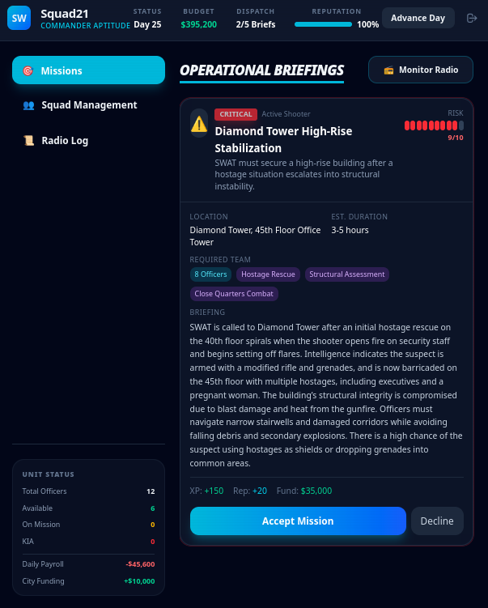

# 🚔 SWAT Watch Commander

**SWAT Watch Commander** is a high-stakes, tactical squad management simulation where you take command of an elite police unit. Powered by a Large Language Model (LLM) acting as a dynamic "Game Master," every mission, every encounter, and every consequence is unique.

<p align="center">
  
  
</p>

## 🎖️ The Simulation
You don't just click buttons; you manage lives. Recruitment, tactical gear investment, departmental economics, and life-or-death decision-making all fall under your command.

### Key Features
- **Dynamic AI Game Master**: Powered by LLM reasoning, every mission briefing and tactical event is generated on-the-fly, creating infinite replayability.
- **Specialized Squad Tactics**: Recruit officers for specific roles including Assault, Sniper, Breacher, Medic, Negotiator, and Tech Specialist.
- **Persistent Ranks & XP**: Watch your recruits grow from **Rookie** to **Lieutenant**. Higher ranks command higher salaries but bring veteran experience to the field.
- **Tactical Gear Upgrades**: Invest budget into Armor, Specialized Weapons, and Utility/Tech levels (1-3). Gear levels directly impact mission survival and success rates.
- **Economic Strategy**: Balance a limited city budget against daily squad payroll, recruitment costs, and equipment upgrades.
- **Solemn Memorial System**: Honor fallen officers with a dedicated funeral service and AI-generated eulogies. End-of-watch is permanent.
- **Narrative-Driven Events**: Direct your team through branching tactical events where your decisions—and your team's gear—determine who comes home.

## 👮‍♂️ Legend of the Force
> "My best officer is Lieutenant Elena Rodriguez. 17 missions. 17 successes. She's the backbone of this department." — *Commander's Log*

## 🛠️ Tech Stack
- **Frontend**: React 19, TypeScript, Vite
- **Styling**: Tailwind CSS with custom premium aesthetics.
- **State Management**: Custom React Hooks with LocalStorage persistence.
- **AI Backend**: OpenAI-compatible API (supports local models like Llama 3, Mistral, or Gemini via local proxy).

## 🚀 Getting Started

### Prerequisites
- [Node.js](https://nodejs.org/) (v18+) or [Bun](https://bun.sh/)
- A running LLM API (local or cloud) compatible with the OpenAI spec.

### Setup
1. Clone the repository:
   ```bash
   git clone https://github.com/skorotkiewicz/swat-watch-commander.git
   cd swat-watch-commander
   ```
2. Install dependencies:
   ```bash
   bun install # or npm install
   ```
3. Configure your environment:
   Create a `.env` file in the root directory:
   ```env
   VITE_LLM_URL=https://api.your-provider.com/v1/chat/completions
   VITE_LLM_MODEL=gpt-4o # Or any OpenAI-compatible model
   ```
4. Run the development server:
   ```bash
   bun dev # or npm run dev
   ```

## 📜 License
This project is open-source and available under the [MIT License](LICENSE).

---
*Built with passion by the SWAT Fans.*
